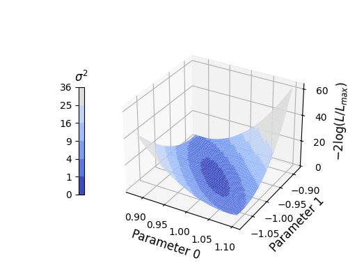

# FitPy

FitPy is an open-source library to fit data in science and engineering. It provides a simple yet complete interface to fit data with compact Python programs. 

## Getting started

Download [fitpy.py](fit.py) to a folder in your computer. 
Add the folder to your PYTHONPATH. 

For example, in Linux you can put the file in the folder ~/python and add the following to the your ~/.bashrc file

```bash
export PYTHONPATH=${HOME}/python:${PYTHONPATH}
```

## Features
  * Linear and nonlinear least squares fits
  * Poisson likelihood ready to fit histograms
  * Binomial likelihood 
  * Calculation of estimators and errors
  * Evaluation of goodness-of-fit with chi-squared test
  * Support for plotting error bands, confidence ellipses, and likelihood functions

## Contributing
If you'd like to contribute, please fork the repository and use a feature
branch. Pull requests are warmly welcome.

## Links
- Repository: https://github.com/ravignad/fitpy/

## Licensing

The code in this project is licensed under MIT license.


Least squares fit            |  Confidence ellipses          | Likelihood function
:-------------------------:|:-------------------------:|:-------------------------:
 |  | 

We provide [in this folder](examples) some examples about using FitPy.


